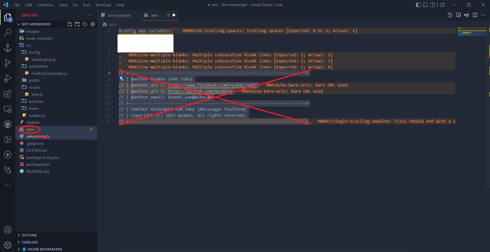

<br />
<div align="center">
  <a href="https://github.com/Nyakkon/bot-messenger">
    
  </a>

  <h3 align="center">CHATBOT MESSENGER FOR PAGE (Messenger Platform)</h3>

  <p align="center">
    Một Bot Chat Hoàn Toàn Tự Động Và Đơn Giản Cho Page!
    <br />
    <a href="https://developers.facebook.com/docs/messenger-platform/webhooks"><strong>Explore the docs »</strong></a>
    <br />
    <br />
    <a href="https://github.com/Nyakkon/bot-messenger/blob/main/package.json">Package Information</a>
    ·
    <a href="https://github.com/Nyakkon/bot-messenger/blob/main/LICENSE.md">License</a>
    ·
    <a href="https://nyakko.me/donate">Donate</a>
    ·
    <a href="mailto:kyuubi.yae@wibu.me">Support</a>
    ·
    <a href="https://nyakko.me">My Website</a>
  </p>
</div>
<br>
    <div align="center"><a href="https://github.com/Nyakkon/bot-messenger/tree/community">Source Botchat From Community</a></div>

<div align="center">
  <a href="https://1999azzar.github.io/1999AZZAR/">
  </a>
</div>


# <div align="center"> Select Languages For README </div>

  <div align="center">
    <a href="https://github.com/Nyakkon/bot-messenger/blob/master/README.md"></a>
    <a href="https://github.com/Nyakkon/bot-messenger/blob/master/ENGLISH.md"></a>
  </div>


# 🛠️Languages and NecessaryTools For Bot

<code><a href="https://www.javascript.com/"></a></code>


<code><a href="https://code.visualstudio.com/?wt.mc_id=DX_841432"></a></code>
<code><a href="https://nodejs.org/en/"></a></code>
<code><a href="https://docs.microsoft.com/en-us/windows/wsl/install"></a></code>
<code><a href="https://heroku.com/"></a></code>


<code><a href="https://git-scm.com/downloads"></a></code>
<code><a href="https://apps.microsoft.com/store/detail/windows-terminal/9N0DX20HK701?hl=en-us&gl=US"></a></code>


 


# 📈Project Title

CHATBOT MESSENGER FOR PAGE (Messenger Platform)

## ✨Description

Một Bot Chat Hoàn Toàn Tự Động Và Đơn Giản Cho Page.

## 🧑‍💻Getting Started

### 📚Dependencies

* Bởi Vì Được Phát Triển Bởi 1 Cá Nhân, Vì Vậy Có Rất Nhiều Lỗi Đòi Hỏi Bạn Phải Có Kiến Thức Về JavaScript
* Bạn Chỉ Cần Chỉnh Sửa Port Và Your Token Tại .env
* Lưu Ý: Nếu Chưa Tải NodeJS, Hãy Tải NodeJS <a href="https://nodejs.org/en/">Tại Đây</a> <a href="https://nodejs.org/en/"></a>.

### 💻Installing

* Hãy Tải Trực Tiếp Tại https://github.com/Nyakkon/bot-messenger.git Hoặc Sử Dụng Lệnh Này Vào Terminal
```
git clone https://github.com/Nyakkon/bot-messenger.git
```
* Mình Đã Cài Đặt Sẵn Các Modules Cần Thiết Để Khởi Chạy Bot. Nếu Có Lỗi Về Node_Modules, Hãy Nhấn <a href="#fix__Modules">Vào Đây</a> Để Biết Cách Fix.
* Bạn Vào .env.example, copy tệp .env.example paste và xoá đuôi .example và xoá dòng

```

This is the Backup/Example Zone of .env


// +------------------------------------------------------------------------+
// | @author Nyakko (Anh Tuấn)
// | @author_url 1: https://www.facebook.com/nyakko.neko
// | @author_url 2: https://github.com/Nyakkon
// | @author_email: kyuubi.yae@wibu.me
// +------------------------------------------------------------------------+
// | CHATBOT MESSENGER FOR PAGE (Messenger Platform)
// | Copyright (c) 2022 Nyakko. All rights reserved.
// +------------------------------------------------------------------------+


```
<p align="center"><a href="https://raw.githubusercontent.com/Nyakkon/bot-messenger/main/img-for-readme.md/Untitled.png"></a></p>


* Cấu Hình Kết Nối Bot Trong .env

```
#config app variables 
PORT=<Example 8080 Then the Port of Localhost is: Localhost:8080>
VERIFY_TOKEN=<YOUR TOKEN *Random*>
PAGE_ACCESS_TOKEN=<TOKEN APP FACEBOOK>
```


* Sử Dụng lệnh Sau để chạy bot nếu đã cấu hình
```
npm start
```

### <p id="fix__Modules">💡Node_Modules Error Correction Support</p>

* Xoá Node_Modules Hiện Tại
* Dán Dòng Lệnh Này Vào Terminal
```
npm install --save express dotenv ejs body-parser
```

* Nếu NodeJS trả lỗi không cài đặt được, sử dụng lại lệnh và xoá --save:
```
npm install express dotenv ejs body-parser
```

* Sau Đó, Sử Dụng Lệnh:

```
npm install --save request
```

* Nếu NodeJS trả lỗi không cài đặt được, sử dụng lại lệnh và xoá --save:

```
npm install request
```

* Nhấn Save All Tại [ Menu > File ] Để Lưu Lại Tất Cả


## 📬Help

Có Bất Kỳ Sự Cố Nào Xảy Ra, Vui Lòng Gửi Email Đến <a href="mailto:kyuub.yae@wibu.me">kyuub.yae@wibu.me</a> Với Tiêu Đề "Hỗ Trợ Messenger Platform"

## ⚡Donate

Bạn nào muốn mua cho mình cốc cà phê có thể nhấn nút dưới này nhé ^^

<p align="center"><a href="https://nyakko.me/donate"> </a></p>

Nếu Muốn Đóng Góp Vào Phát Triển Của Bot, Hãy Push Code vào <a href="https://github.com/Nyakkon/bot-messenger/tree/community"Nhánh Community</a>

## 🧰Authors

[@yaekyuu-Twitter](https://twitter.com/yaekyuu)


[Anh Tuấn-Facebook](https://facebook.com/nyakko.neko)

## 📝Version History

* 1.0.0
    * Phiên Bản Đầu Tiên

## 🌱License

<p>This project is licensed under the [NYAKKO TEAM] License - see the <a href="https://github.com/Nyakkon/bot-messenger/blob/main/LICENSE.md">LICENSE.md</a> file for details</p>

<a href="https://www.facebook.com/nyakko.neko/"></a>

-----

Credits: [Nyakko](https://github.com/nyakkon) <a href="https://www.facebook.com/nyakko.neko/"></a>

Last Edited on: 30/07/2022
